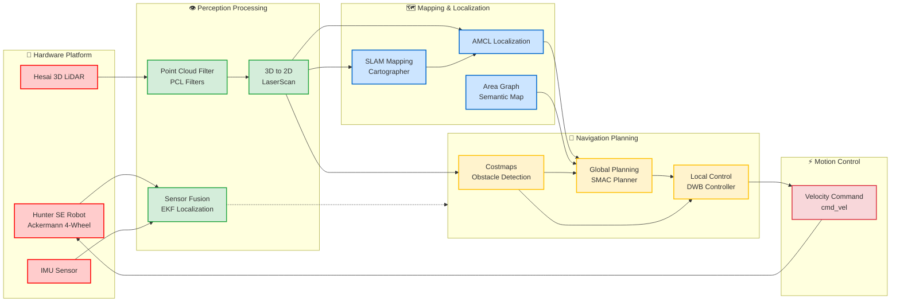

## Motivation

Campus logistics require a single vehicle to navigate open outdoor paths and complex indoor corridors seamlessly. The core challenges are robust scene switching, safe real-time avoidance, and reliable navigation across diverse conditions. This project targets these challenges to enable unified, end-to-end campus delivery.

## Contributions

- Built a campus delivery platform on **Agile X HUNTER SE** with integrated **Hesai PandarQT64** and panoramic vision.
- Established **dual-environment navigation** with GPS-aided outdoor and LiDAR-based indoor localization.
- Integrated **ROS2 Nav2** with **Cartographer** for mapping, planning, and control.
- Demonstrated **real-time dynamic obstacle avoidance** and robust path re-planning.

    

        
    

    

        
    

    From a bare chassis to a fully equipped autonomous delivery robot, ready for the challenges of a dynamic campus.

## System Overview

The platform is equipped with a rugged base, 64-line LiDAR, panoramic RGB camera, and inertial/odometry sensors to provide reliable perception across indoor/outdoor conditions.

The software stack leverages **ROS2 + Nav2** for planning and control, with **Google Cartographer** for SLAM. Real-time perception supports dynamic obstacle avoidance and continuous re-planning for safe navigation in crowded scenes.

## Key Capabilities

- **Dual-environment navigation** with seamless switching between GPS-aided outdoor and LiDAR-based indoor localization.
- **Real-time obstacle avoidance** with dynamic re-planning for safe navigation in crowded environments.

## System Architecture

The system integrates sophisticated hardware and software components:

    Interactive system architecture diagram showing the data flow from hardware sensors through perception, mapping, navigation planning to motion control.

## Tech Stack

- **Programming Languages**: C++17, Python 3.8+
- **Robotics Framework**: ROS2 Humble
- **Navigation**: Navigation2 (Nav2) stack
- **SLAM Algorithm**: Google Cartographer
- **Point Cloud Processing**: PCL (Point Cloud Library)
- **Computer Vision**: OpenCV, ROS2 Image Pipeline
- **Hardware Interface**: ROS2 device drivers
- **Simulation**: Gazebo Classic

## Results

- **Localization Accuracy**: ±0.2 m (indoor)
- **Goal Reaching**: 95% success rate
- **Collision Safety**: 100% collision-free in tests
- **Throughput**: 20 Hz sensor processing
- **Endurance**: 4+ hours continuous operation
- **Payload**: Up to 10 kg

## Next Steps

Integrate **osmAG** map format with Nav2 plugins for lifelong mapping and accuracy improvements, explore **multi-robot coordination** for fleet operations, and strengthen robustness under varied weather and lighting conditions.

## Project Team

- **Lead Developer**: Jiajie Zhang (zhangjj2023@shanghaitech.edu.cn)
- **Co-developer**: Yongqi Zhang (zhangyq12023@shanghaitech.edu.cn)
- **Advisor**: Professor Sören Schwertfeger

## Related Resources

- **Project Report**: [Campus Autonomy Final Report](/files/CampusAutonomy_FinalReport.pdf)
- **Demo Video**: [System Demonstration](/videos/campusautonomy.mp4)
- **Code Repository**: [GitHub Repository](https://github.com/jiajiezhang7/campus-autonomy-course-project)

---

_This project successfully demonstrates the practical application of modern autonomous navigation technologies in a real-world campus, marking a significant step forward for service robotics and autonomous delivery._
