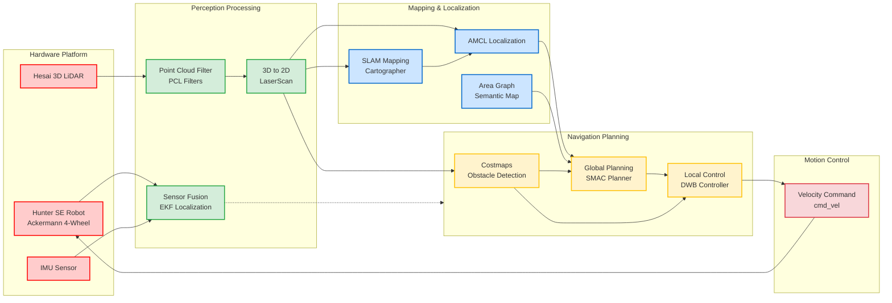

    

        

            <video class="hero-video hero-video-contain" id="campus-hero-video" autoplay muted loop playsinline preload="auto"
                   aria-label="Indoor and outdoor delivery runs on a Hunter SE platform">
                <source src="{{ site.baseurl }}/videos/campusautonomy.mp4" type="video/mp4">
                Your browser does not support the video tag.
            </video>
        

        

            <strong>Demo</strong>: Indoor/outdoor delivery runs on a single Hunter SE platform.
        

    

## Abstract

Campus logistics needs one vehicle that can leave open outdoor paths, enter indoor corridors, and keep moving under pedestrians and temporary obstacles. This project builds an end-to-end delivery stack on Agile X HUNTER SE: GPS-aided outdoor localization, LiDAR-based indoor localization, Cartographer mapping, and ROS2 Nav2 planning/control with continuous costmap-driven re-planning.

## Contributions

- Integrated **Hesai PandarQT64**, panoramic RGB, IMU/odometry on an Ackermann **Hunter SE** chassis into a ROS2 Humble vehicle.
- Split localization by domain: **GPS-aided outdoor** vs **LiDAR-based indoor**, with scene switching for dual-environment runs.
- Wired **Google Cartographer** for mapping and **Nav2** (SMAC global planner + DWB local controller + layered costmaps) for planning and control.
- Demonstrated **real-time dynamic obstacle avoidance** with path re-planning in crowded campus scenes.

    

        
    

    

        
    

    Left: bare Hunter SE chassis. Right: completed delivery robot with LiDAR, cameras, and compute.

## Method

Hardware: Ackermann 4-wheel Hunter SE, 64-line 3D LiDAR, panoramic RGB, IMU. Perception downsamples and filters the cloud (PCL), projects 3D → 2D LaserScan for 2D planners, and fuses IMU/odometry with an EKF. Mapping uses Cartographer; indoor pose tracking uses AMCL (with an Area Graph semantic map available as a planning prior). Navigation uses SMAC globally and DWB locally against obstacle costmaps; `cmd_vel` closes the loop on the chassis.

```mermaid
graph LR
    subgraph HW["Hardware Platform"]
        A[Hunter SE Robot<br/>Ackermann 4-Wheel]
        B[Hesai 3D LiDAR]
        C[IMU Sensor]
    end

    subgraph Perception["Perception Processing"]
        D[Point Cloud Filter<br/>PCL Filters]
        E[3D to 2D<br/>LaserScan]
        F[Sensor Fusion<br/>EKF Localization]
    end

    subgraph Mapping["Mapping & Localization"]
        G[SLAM Mapping<br/>Cartographer]
        H[AMCL Localization]
        I[Area Graph<br/>Semantic Map]
    end

    subgraph Navigation["Navigation Planning"]
        J[Global Planning<br/>SMAC Planner]
        K[Local Control<br/>DWB Controller]
        L[Costmaps<br/>Obstacle Detection]
    end

    subgraph Control["Motion Control"]
        M[Velocity Command<br/>cmd_vel]
    end

    A --> F
    B --> D --> E
    C --> F

    E --> G
    E --> H
    E --> L

    G --> H
    H --> J
    I --> J

    L --> J
    J --> K
    L --> K

    K --> M --> A

    F -.-> Navigation

    classDef hw fill:#ffcccc,stroke:#ff0000,stroke-width:2px
    classDef perc fill:#d4edda,stroke:#28a745,stroke-width:2px
    classDef map fill:#cce5ff,stroke:#0066cc,stroke-width:2px
    classDef nav fill:#fff3cd,stroke:#ffc107,stroke-width:2px
    classDef ctrl fill:#f8d7da,stroke:#dc3545,stroke-width:2px

    class A,B,C hw
    class D,E,F perc
    class G,H,I map
    class J,K,L nav
    class M ctrl
```

    Sensor → perception → mapping/localization → Nav2 planning → chassis command.

## Results

Measured / claimed operating envelope from project tests:

- **Indoor localization**: ±0.2 m
- **Goal reaching**: 95% success rate
- **Collision safety**: 100% collision-free in the reported test set
- **Sensor processing**: 20 Hz
- **Endurance**: 4+ hours continuous operation
- **Payload**: up to 10 kg

## Failure Cases / Limitations

- **osmAG** map format is not yet integrated with Nav2 plugins; lifelong map updates and area-graph-native planning remain unfinished.
- Dual-environment switching is demonstrated, but robustness under varied weather and lighting is not fully characterized.
- Multi-robot / fleet coordination is out of scope for the current single-vehicle stack.

## Project Team

- **Lead developer**: Jiajie Zhang (zhangjj2023@shanghaitech.edu.cn)
- **Co-developer**: Yongqi Zhang (zhangyq12023@shanghaitech.edu.cn)
- **Advisor**: Professor Sören Schwertfeger

## Related Resources

- **Report**: [Campus Autonomy Final Report](/files/CampusAutonomy_FinalReport.pdf)
- **Code**: [campus-autonomy-course-project](https://github.com/jiajiezhang7/campus-autonomy-course-project)
