## Motivation

Indoor environments change frequently, making conventional maps quickly outdated. This project develops a SLAM system that focuses on persistent structures to produce clean, long-lasting maps for dependable lifelong indoor navigation.

## Method Overview

The system applies real-time **vertical plane segmentation** on 3D LiDAR using RANSAC to extract large structural surfaces (e.g., walls) and filter out transient objects.

### Algorithm Pipeline

```mermaid
graph LR
    %% Main System Flow
    A[3D LiDAR<br/>Sensor] --> B(Raw Point Cloud<br/>/point_cloud)
    B --> C1

    %% Core Contribution: Vertical Plane Segmentation Node
    subgraph CoreAlgo["🔍 Core: Vertical Plane Segmentation"]
        C1[1. Voxel Grid<br/>Downsampling]
        C2[2. Plane Seg<br/>RANSAC]
        C3{3. Vertical?}
        C4[4. Accumulate<br/>Vertical Planes]
        C5[5. Project to<br/>2D LaserScan]

        C1 --> C2 --> C3
        C3 -->|Yes| C4 --> C5
        C3 -->|No| C2
    end

    C5 --> D(Filtered 2D<br/>LaserScan /scan)
    D --> E[Gmapping<br/>SLAM]
    E --> F((Clean 2D<br/>Structural Map))

    %% Styling
    classDef coreStyle fill:#ffe6f0,stroke:#ff1493,stroke-width:2px
    classDef outputStyle fill:#e6f3ff,stroke:#0066cc,stroke-width:2px
    classDef processStyle fill:#fff9e6,stroke:#ffa500,stroke-width:2px

    class C1,C2,C3,C4,C5 coreStyle
    class F outputStyle
    class A,B,D,E processStyle
```

    The complete processing pipeline from raw 3D point cloud to clean 2D structural map. The core contribution (highlighted in pink) is the vertical plane segmentation node that filters out transient objects.

## From Simulation to Reality: Proving the Concept

We validated the approach in Gazebo simulation and real laboratory corridors with transient obstacles, consistently producing clean structural maps in real time.

### Simulation Test

    

        
    

    

        
    

    Testing our approach, from controlled simulations in Gazebo to dynamic, real-world laboratory environments.

### Real World Experiment

    

        <video width="100%" controls>
            <source src="{{ '/videos/slam_projects.mp4' | relative_url }}" type="video/mp4">
            Your browser does not support the video tag.
        </video>
    

    Live demonstration of the vertical plane segmentation SLAM system in action, showing real-time mapping in dynamic indoor environments.

    

        
    

    

        
    

    Real World Experiment: The cluttered reality (left) versus the clean, structural map our system generates (right).

After isolating structural planes, the 3D point cloud is projected into a 2D laser scan, enabling the use of mature 2D SLAM (e.g., Gmapping) to build efficient, structure-consistent maps.

## Tech Stack

- **Programming Languages**: C++14, Python 3.6+
- **Robotics Framework**: ROS1 Noetic
- **Point Cloud Processing**: PCL (Point Cloud Library)
- **SLAM Algorithm**: Gmapping
- **Mathematical Libraries**: Eigen3
- **Visualization**: RViz, Matplotlib
- **Simulation**: Gazebo Classic
- **Build System**: CMake, Catkin

## Results

- **Processing**: 10 Hz point cloud processing; 1 Hz map updates
- **Resources**: < 200 MB memory; < 25% CPU (Intel i7-8700K)
- **Map Quality**: 95% wall detection; 80% transient noise reduction; consistent maps over multiple runs

## Applications

- **Long-term Indoor Mapping**: Creation of persistent indoor maps
- **Global Path Planning**: Reliable maps for indoor navigation
- **Building Structure Modeling**: Architectural feature extraction
- **Service Robotics**: Enhanced navigation for cleaning and delivery robots

## Next Steps

Extend to **multi-floor** mapping, integrate **semantic segmentation** (e.g., walls vs. doors), and migrate to **ROS2** for modern, scalable deployments.

## Project Team

- **Developer**: Jiajie Zhang (zhangjj2023@shanghaitech.edu.cn)
- **Advisor**: Professor Sören Schwertfeger

## Related Resources

- **Project Slides**: [SLAM Project Defense](/files/CS284_SLAM_Project_Defence.pdf)
- **Demo Video**: [System Demonstration](/videos/slam_projects.mp4)
- **Code Repository**: [GitHub Repository](https://github.com/jiajiezhang7/cs284_slam_project)

---

_This project makes a significant contribution to the field of lifelong SLAM, offering a practical and robust solution for creating persistent indoor maps that stand the test of time._
